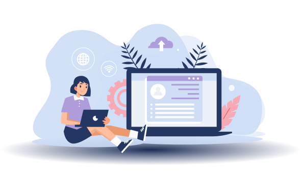
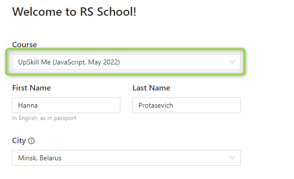
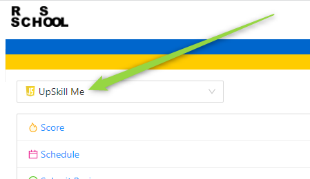
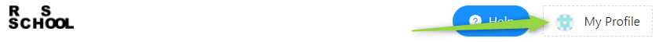

## Welcome to Front-end course UpSkill Me

### About course
[The course](../README.md) is divided into **3 stages**.

On **stage 1** you will learn *git, HTML, Css, Flex, Grid* and get basic knowledge on *JavaScript*. After stage 1 you will pass the interview, according to knowledge you got,  with your future mentor.

During **stage 2** you will improve knowledge on *JavaScript*, get familiar with *TypeScript,NPM, Webpack, Testing, Software Methodology*,  implement interesting tasks. Your mentor will check tasks and provide valuable feedback. This stage  will finish with an interview as well, according to information from stage 2.

And finally, **stage 3** will let you know about **Angular** - one of the most in-demanded framework nowadays.

Stage consists of weeks. Each week you will have a test or task or even several assignments.

### Registration
During this course, you will use several online resources: Rolling Scopes application (RS app), freecodecamp, codewars. First of all you should pass the registration to RS app.
1. Follow the link https://app.rs.school/registry/student?course=upskill-me

2. Make sure you choose the *'UpSkill Me (JavaScript, May 2022)'* course
3. Fill in all fields with information about yourself
4. Visit the https://app.rs.school/, fillin your profile. RS app will be the main resource to pass task/test and follow your progress

### Communication
The main channel for communication is [Discord](https://discord.gg/KGDNASy6x8). Following the [code of conduct](https://docs.app.rs.school/#/code-of-conduct) is mandatory!
Do not forget to introduce yourself in the appropriate [channel](https://discord.gg/zQNhp7EVBw) - it helps us to know about new students. In case of any questions, you may contact Hanna_Pratasevich#3238.

See you there!

### Useful links
1. [Schedule](../../UpSkillMe/README.md)
2. [Discord](https://discord.gg/KGDNASy6x8)
3. [RS application](https://app.rs.school/)
4. [Registration to RS app](https://app.rs.school/registry/student?course=upskill-me)
5. [Code of Conduct](https://docs.app.rs.school/#/code-of-conduct)
6. [Booking](https://booking.lab.epam.com/)
