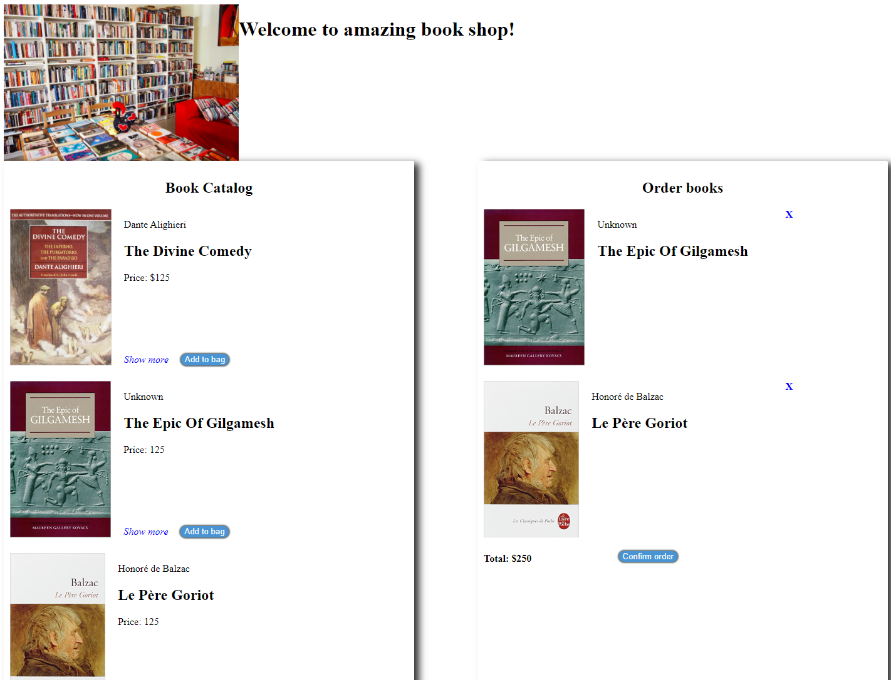
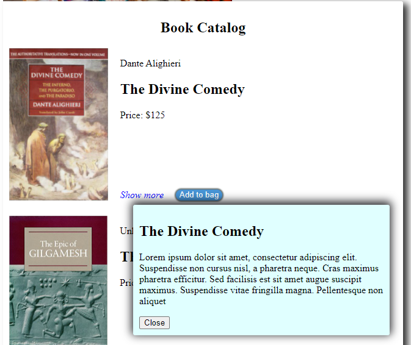

# Books shop

## Task
The books shop owner asked you to create the online shop to buy book with delivery to user's home. He wants the user to be able to look through the books' catalog, see the description of a particular book, add a book to the bag, choose the appropriate date and address to deliver. 

## Stages of task completion
**Week_1**: Layout of catalog page (the page should be created through the JavaScript code. It means. You have html file without tags (if you need, you may add main or div as wrapper, not more). All tags should be created in the js code. Styles you describe in the css file, using JavaScript you add css classes to created tags), the delivery form (should be created inside the HTML file)

**Week_2**: Add actions to pages: 
 * add book to the bag by click on appropriate button or by drag the image of book to the bag (drag and drop), 
 * show popup with book description by click on Show more button
 * close popup by click on Close or cross button 
 * remove book from the bag by the cross button, 
 * validation of form fields after user left the field, 
 * summarize the personal information after user clicks on Complete button

### Scoring criteria (maximum 100 points)
1. The content of catalog page created thru the JavaScript. User sees the book image, title, author, price, show more and add to bag buttons **+10**
2. After user clicks on Show more button the popup with description and close button are shown **10**
3. The HTML elements should be added to page by one step (it's a hint to read about document fragment) **+10**
4. When the user adds the book to the bag (either by click on Add to bag button or by drag-and-drop), the book appears in the bag with shorten data (title, author, price) and remove (cross) button. Also, the total sum is updated **+20**
5. When user click on Confirm order he appears in the Order form page  **+5**
6. The order form contains fields with own validation rules and Complete button **+20**
   * Name (mandatory, the length not less than 4 symbols, strings only)
   * Surname (mandatory, the length not less than 5 symbols, strings only)
   * Delivery date(mandatory, not earlier than next day)
   * Street (mandatory, the length not less than 5 symbols, the numbers are allowed)
   * House number(mandatory, numbers only, positive numbers only)
   * Flat number(mandatory, numbers only, positive numbers only, the dash symbol is allowed. Means, the flat number shouldn't start with minus/dash symbol. For example:  -37 is invalid, but 1-37 is valid)
   * Choose the payment type(radio buttons group): Cash or Card (mandatory)
   * Choose 2 gifts:  (optional)
     - pack as a gift, 
     - add postcard, 
     - provide 2% discount to the next time, 
     - branded pen or pencil
7. The Complete button is disabled until the user full form with valid information **+5**
8. If user left the field empty or full of invalid data, this field became red (means red border) and the validation message (The field is invalid)  is appeared. After user fix data and left the field again, the validation red border and message should disappear. **+5**
9. After user full all mandatory field with valid information, the Complete button become active. **+10**
10. After user click on Complete button, he will see the summarized information: for instance, The order created. The delivery address is Amazing street house 3 flat 10. Customer John Gald. **5**

### Examples of layout
Pay attention, it's just the example on how the elements placed. The design is fully **up to students**. The authors of **top-5** most interesting design according to the students vote will receive additional **20 points**




### Note
The json with books information you will find by the [link](books.json).Copy it to your project. To read json data from the file you may use next code 
```javascript   
fetch('../books.json') //path to the file with json data
        .then(response => {
            return response.json();
        })
        .then(data => {
            console.log(data);
        });
```

How to work with files, asynchronous data and so on will be in the future modules
