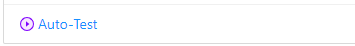
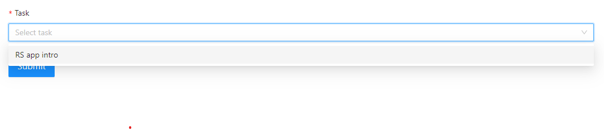
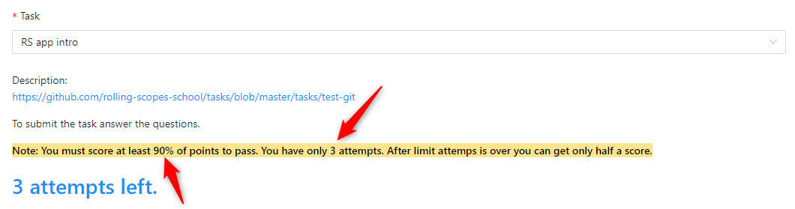

## How to pass the test?

1. Authorized in the RS app
2. Choose the Auto-Test option in the main menu
   
3. Find the appropriate test in the dropdown
   
4. Pay attention to the precondition. It might be different from test to test
   